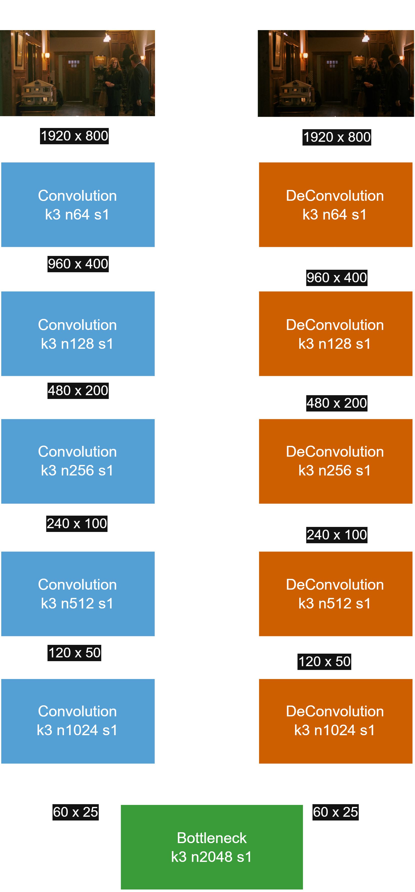
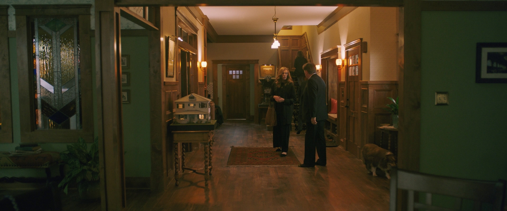
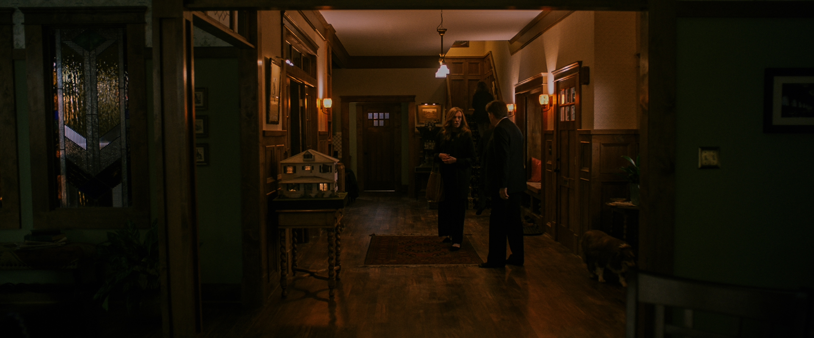

# HDR Reconstruction from SDR Film Material using U-Net

This project investigates the impact of a so-called native dataset on the performance of a U-Net-based architecture for Inverse Tone Mapping (SDR → HDR) in film material.

The main goal is to integrate human color grading decisions into the training process by using paired SDR and HDR versions of real movies instead of synthetically generated data.

Unlike common approaches, the SDR data in this project is not generated algorithmically from HDR data via Tone Mapping.  
Instead, it is extracted from commercially available SDR and HDR film versions, resulting in a native dataset that better reflects real production pipelines.

## Model Architecture

The reconstruction model is based on a U-Net architecture designed for image-to-image translation tasks.
It follows an encoder–decoder structure that progressively compresses and reconstructs spatial information while preserving details through skip connections. These skip connections enable the direct transfer of high-resolution features from the encoding to the decoding stages, which helps maintain structural consistency in the reconstructed images.

Training is performed using paired SDR and HDR frames, enabling supervised learning of the inverse tone mapping process and facilitating accurate reconstruction of both luminance and color information.

  

### Loss Function

Several loss functions were evaluated during preliminary experiments:

- Mean Squared Error (MSE)
- Structural Similarity Index (SSIM) [1]

SSIM was selected as the final loss function due to its superior performance.

### Color Representation

Two approaches were evaluated:

- Luminance-based training
- RGB-based training

Both showed similar quantitative performance.  
The RGB model was selected due to its ability to additionally learn color gamut expansion from Rec.709 (SDR) to Rec.2020 (HDR).

## Visual Comparison

Below is a qualitative comparison between the input SDR image, the reconstructed HDR output using the RGB-based model trained on the native dataset and the ground truth HDR image. 

   
  <b>Input (SDR)</b>

   
  <b>Prediction (HDR)</b>

   
  <b>Ground Truth (HDR)</b>

In most cases the model was able to achieve a visual alignment to the ground truth image.

## Quantitative Results

Evaluation was performed using the image quality metric HDR-VDP-3 which was specifically designed to assess HDR image quality.

| Dataset Type     | Mean HDR-VDP |
|------------------|--------------|
| Native           | 7.98         |
| Reinhard TMO [2] | 7.74         |
| Hable TMO [3]    | 7.01         |
| Möbius TMO       | 7.89         |

The native dataset achieved the highest average score.

Due to the limited size of the test set, statistical significance could not always be established. Larger datasets may improve reliability.

## Future Work

Potential extensions include:

- Evaluation of additional tone mapping operators
- Integration of local operators
- Multi-frame / video reconstruction
- Combination with super-resolution
- Compression-aware reconstruction

## References

[1] Zhou Wang, Alan C. Bovik, Hamid R. Sheikh, E.P. Simoncelli. *Image quality assessment: from error visibility to structural similarity*. IEEE Transactions on Image Processing, vol. 13, no. 4, pp. 600–612, Apr. 2004. doi: [10.1109/TIP.2003.819861](https://doi.org/10.1109/TIP.2003.819861)

[2] Erik Reinhard, Michael Stark, Peter Shirley, James Ferwerda. *Photographic tone reproduction for digital images*. Seminal Graphics Papers: Pushing the Boundaries, Volume 2, vol. 2, no. 3, pp. 267–276, Jul. 2002. doi: [10.1145/566654.566575](https://doi.org/10.1145/566654.566575)

[3] Haarm-Pieter Duiker. *Filmic Tonemapping for Real-time Rendering*. Siggraph 2010 Color Course, Siggraph, Online, 2010. URL: [Link](http://duikerresearch.com/2015/09/filmic-tonemapping-for-real-time-rendering/)

---

Due to copyrighting issues the used dataset cannot be shared in this repository.

